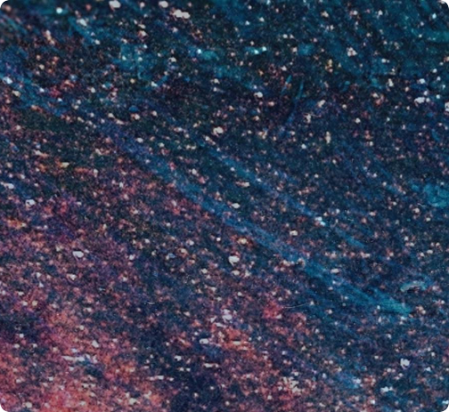

📸 Roundshot - 圆角截图工具
===


`roundshot` 是一个轻量级的 Bash 脚本工具，用于生成带有自定义圆角的截图。

**[English](README.md) | [中文](README.zh-CN.md)**

### 预览


### 🚀 使用方法
```bash
roundshot [选项] [半径]
```

运行命令后使用 Flameshot 选择区域。截图将：
- 保存到 `~/Pictures/Screenshots/`
- 复制到剪贴板（可直接粘贴）

✨ 特性
===
- 可自定义圆角半径（像素单位）
- 自动复制到剪贴板

📦 安装
===
```Bash
# 1. clone repo && change directory
git clone https://github.com/Youpen-y/roundshot.git
cd roundshot

# 2. install it
sudo make # 或 sudo make install
```
这将创建一个指向脚本的符号链接 `/usr/bin/roundshot`.

🔧 依赖
===
- [flameshot](https://github.com/flameshot-org/flameshot)（必需 >= v0.7.3）
- [ImageMagick](https://github.com/ImageMagick/ImageMagick)（必需 >= 6.3.5+）
- xclip（X11）或 wl-clipboard（Wayland）- 用于剪贴板复制

#### 依赖安装：
```Bash
# Ubuntu
sudo apt install flameshot imagemagick xclip
# 或 Wayland：
sudo apt install flameshot imagemagick wl-clipboard
```

#### 键盘快捷键（**推荐**）

大多数桌面环境允许你将自定义命令绑定到热键：

- GNOME / Ubuntu

    1. 设置 → 键盘 → 键盘快捷键
    2. 点击 "+" 添加自定义快捷键
    3. 名称：Roundshot
    4. 命令：roundshot（或 roundshot 20 设置默认 20px 半径）
    5. 快捷键：按下你想要的组合键（例如：Ctrl+Alt+S）

- KDE Plasma

    1. 系统设置 → 快捷键 → 自定义快捷键
    2. 添加 → 命令 URL
    3. 设置命令和触发器

- XFCE

    1. 设置 → 键盘 → 应用程序快捷键
    2. 添加：roundshot → 按下组合键

### 示例
普通截图（直角）：


Roundshot（自定义圆角半径）：
- 默认半径（10px）
```bash
$ roundshot              # 默认 10px 半径
```

- 100px 半径
```bash
$ roundshot 100           # 自定义 100px 半径
```


❤️ 支持
===
如果你觉得这个工具有帮助，请给它点个星！

📄 许可证
===
MIT License
